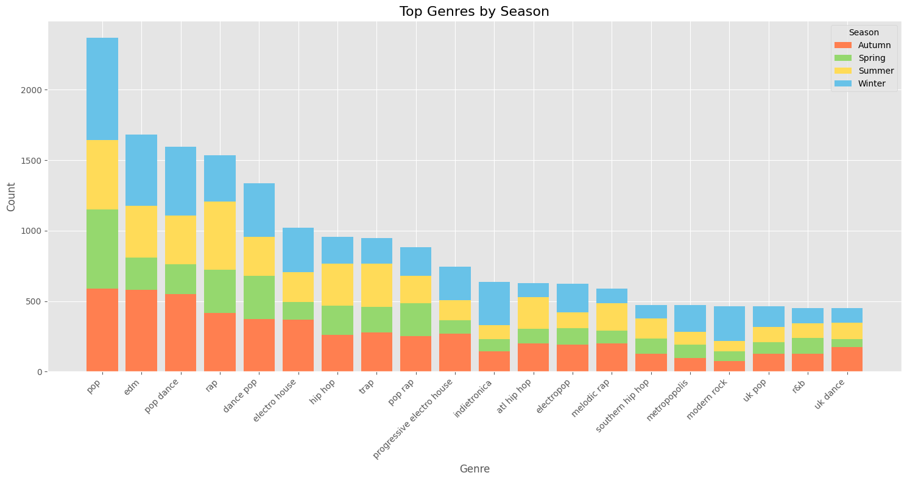

<link href='https://fonts.googleapis.com/css?family=Bungee' rel='stylesheet'>
<h2 style="font-family: 'Bungee', sans-serif; color: #00d0e3; font-size: 24px;">Soundtrack of My Life: Unraveling My Spotify Saga Over The Last 9 Years</h2>

#### Click here to see the Jupyter Notebook for [this EDA](https://github.com/v4rshi/v4rshi.github.io/blob/master/notebooks/seasons_eda.ipynb)!
--- 
**Project Description**: Using [Exportify](https://exportify.net/), I gathered my Spotify playlist data and wondered: can this reveal my mood and well-being over the years based on when I listened to songs and the sentiment in their names and lyrics?

**Data**: The dataset spans April 2016 to August 2024, including artist, track, genre, and an attribute called Valence (high = positive, low = negative). Read more about it [here](https://community.spotify.com/t5/Spotify-for-Developers/Valence-as-a-measure-of-happiness/td-p/4385221). 

**Motivation & Hypothesis**: This period covers a significant part of my life, from college in Indiana to married life in San Francisco, with a pandemic in the middle. My playlists serve as emotional journals, and I want to explore how they reflect my evolving moods and life events.

Key focus areas for this project include: 

1. Track my evolving music taste over time.
2. Examine playlist patterns by seasons  (Am I as predictable as I think?).
3. Use LLMs for sentiment analysis of lyrics (and maybe build a recommender system based on that?)

By doing this analysis, I hope to reveal how my music choices reflect my life experiences and emotions. 

##### **Note: Data shows song additions, not play frequency. Play data would enable more in-depth analysis of listening patterns.**

---

## Findings and Visualizations: 
### NOTE: Click on any graph to zoom in! 

### 1. Top Artist of All Time: 
I was fully expecting my top artist to be Charli XCX but it is actually... Future??? I did not see this in my Future.

To dig into this deeper, I looked into when I added all the songs with Future on them... to find most of it was this year. 

Bingo! This year, Future took the lead, thanks to his 2024 albums *We Don’t Trust You* and *We Still Don’t Trust You*.

### 2. Seasonal Artists: 
Spring is ["BRAT Green"](https://www.cnn.com/2024/07/23/style/brat-summer-green-explained/index.html) with Charli XCX; winter features an eclectic mix of Disney, Britney Spears, and BTS. *(P.S. Click "BRAT" if you're unfamiliar with the term.)*

### 3. Playlist Curation Frequency by Month/Season
My curation became erratic post-2022 due to full-time work, with a notable spike in August 2024 during a stressful period.

### 4. Songs Added by Season over the years:
I added the most songs during the pandemic in 2020 and my unemployment in 2024—two challenging times.

### 5. Song Additions Normalized by Season:
I normalized the data by dividing the number of songs added each season by the number of days in that season and then by the 9 years in my dataset (almost a third of my life!). Winter sees the most activity, likely due to long college breaks and bad weather. 

### 6. Seasonal Music Traits:

My taste remains consistent year-round, favoring high-energy, danceable songs.

### 7. Comparing 2019-2020 vs. 2023-2024:

I focused on comparing 2019-2020 and 2023-2024 to see how they differed. My rationale for this comparison is as follows::

- 2020 was the year of the pandemic, and 2019 is a baseline to compare pre and post COVID-19 music preferences
  
  
  
- 2023 was the year I got married but 2024 was the year I was stuck without a job in a bad market
  
  

Despite the pandemic, 2020 featured more upbeat songs (grad school acceptance!), while 2024 showed declines in most traits (except tempo) during my job search.

---
### 8. Valence Over Time:

Initially, I plotted Valence over time and included a monthly moving average, but the resulting graph was too messy and hard to interpret.
##### Note, the gap in the graph is around the time I briefly used Apple Music - a time we will not speak of again... hehe. 

Instead, I plotted a graph to analyze and visualize the average monthly valence of my Spotify playlist data over time, with annotations for significant life events.

Observations:
- **Valence Fluctuations**: Sharp changes in Valence often coincide with significant life events.
- **Drops**: Notable declines occur around events like "Terrible Birthday," "Huge Fight," and "Loved One Died," reflecting negative experiences.
- **Spikes**: Increases happen around events like "Reconciled with a Friend" and "Got Married," indicating positive emotions.
- **Trend**: Valence is generally stable but varies with life events.

These patterns suggest my music preferences mirror my emotional state, encouraging deeper exploration through sentiment analysis to understand my emotions over time.

### 9. Top Genres by Season:
I was surprised to find 'Modern Rock' appearing in my winter playlists. It seems like an anomaly; it has nearly vanished in later years.

<iframe src="images/spotify_project/top_10_genres_by_season.html"  style="width: 100%; height: calc(100vw * 3 / 4);"></iframe>

I was then curious to see which years' wintertime this rock music phase happened in

<iframe src="images/spotify_project/rock_winter.html" style="width: 100%; height: calc(100vw * 3 / 4);"></iframe>

It is pretty apparent that as time passed, this genre no longer appeared in my playlists, appearing as little as 1 time in 2023 (talk about ROCK bottom :P)

I then tried to visualize this differently with a stacked bar chart and over the top 20 genres overall

This chart displays the popularity of various music genres across seasons:
- Pop is the most popular, followed by EDM and pop dance, especially in winter.
- Rap and hip hop are more popular in summer.
- Genres range from mainstream to niche, with electronic and dance genres leading.
- All genres, including less popular ones like UK dance and R&B, shift seasonally.

I also did this by top 5 Genres over the years separated by season: 
<iframe src="images/spotify_project/top5genre_chart.html" style="width: 100%; height: calc(100vw * 3 / 4);"></iframe>
Key points:

- Genres shift widely across seasons and years.
- Pop and rap consistently appear.
- Summer 2017 had the most diverse genres.
- Recent years (2022-2024) show more stable genre distribution, with new genres emerging over time.

### 10. Nostalgia vs. New Music:

A boxplot visually represents data spread and symmetry by dividing it into quartiles, showing the median and potential outliers. For more on interpreting boxplots, see [this guide](https://www.simplypsychology.org/boxplots.html).

**Key findings:**

- **Overall:** I mostly listen to songs up to 10 years old, regardless of season.
- **Summer:** I gravitate toward older tracks, likely due to nostalgia.
- **Autumn:** I prefer newer, recently added songs.
- **Winter/Spring:** My choices blend summer's oldies and autumn's new hits.
- **Occasional Oldies:** I sometimes listen to tracks from 60-70 years ago.
- **Older Music:** I favor older songs year-round, especially in summer, less so in autumn.

In summary, my music preferences shift with the seasons, with summer evoking nostalgia and autumn sparking interest in new music.

I also looked at yearly trends to see if this nostalgic streak holds up over time:

The trend of favoring older music remains consistent, except for Spring 2023 and part of Winter 2024, when I leaned towards newer releases.

### 11. Genre [Pareto](https://www.cec.health.nsw.gov.au/CEC-Academy/quality-improvement-tools/pareto-charts#:~:text=The%20Pareto%20Chart%20is%20a,represented%20by%20the%20curved%20line.) Analysis: 

The Pareto principle (80/20 rule) suggests that 80% of effects come from 20% of causes, guiding efforts toward the most impactful areas. In my case, nearly 50% of my music is concentrated in just 30 of 1412 genres, indicating a preference pattern. While the graph below only shows the top 100 genres, masking the full Pareto distribution, this observation hints at potential insights for building a recommendation engine, though I'll explore that later.

### 12. t-SNE & K-Means Clustering:
t-SNE simplifies complex data into a 2D map to reveal patterns, while KMeans groups similar items into clusters. In this analysis, t-SNE visualizes the data, and KMeans clusters songs based on audio features. Using the elbow method, I determined four optimal clusters. Click on any of the following links to learn more about these methods: [t-SNE](https://towardsdatascience.com/t-sne-clearly-explained-d84c537f53a), [K-means clustering](https://medium.com/@amit25173/k-means-clustering-for-dummies-a-beginners-guide-399fb8c427fd), [Elbow method](https://www.analyticsvidhya.com/blog/2021/01/in-depth-intuition-of-k-means-clustering-algorithm-in-machine-learning/). Here’s the result: 

<iframe src="images/spotify_project/tsne_clustering.html" style="width: 100%; height: calc(100vw * 3 / 4);"></iframe>

This graph shows a t-SNE (t-Distributed Stochastic Neighbor Embedding) visualization of song clustering based on audio features. Key takeaways are:

- **Number of Clusters**: The graph and centroid table show 4 clusters (0, 1, 2, 3), represented by different colors.
  
- **Cluster Distribution**:
  - Some overlap between clusters is expected due to genre similarities.
  - Clear concentrations suggest the algorithm identified meaningful groupings.

- **Cluster Characteristics**:
  - **Cluster 0 (Purple)**: Mid energy, high danceability, high speechiness.
  - **Cluster 1 (Orange)**: Highest energy and valence, low speechiness—likely upbeat, danceable pop.
  - **Cluster 2 (Blue)**: Lowest energy, highest acousticness and instrumentalness.
  - **Cluster 3 (Pink)**: Second-highest energy, longest duration, lowest popularity.

- **Spatial Distribution**: Clusters aren't perfectly separated, showing shared characteristics and variability within genres.

- **Feature Importance**: Energy differentiates clusters, especially high-energy (Cluster 1) vs. low-energy (Cluster 2). Acousticness and instrumentalness influence Cluster 2's separation.

- **Popularity**: Cluster 1 is the most popular, but popularity isn't the main clustering factor.

- **Tempo and Duration**: Variations in tempo and duration across clusters contribute to differentiation, though not visible in the t-SNE plot.

- **Outliers**: Scattered points may represent unique or genre-blending tracks.

In summary, the t-SNE plot effectively visualizes clusters based on audio features, reflecting the complexity of music categorization, with overlap showing shared characteristics across genres.

**I also looked at the seasonal distribution of clusters for a kick**

<iframe src="images/spotify_project/cluster_distribution_by_season.html" style="width: 100%; height: calc(100vw * 3 / 4);"></iframe>

**Key Takeaways**:

- **Seasonal Patterns**:
  - Cluster 1 (red) dominates year-round.
  - Cluster 3 (purple) is second, peaking in Winter and Autumn.
  - Clusters 0 (blue) and 2 (green) remain consistent across seasons.

- **Seasonal Variations**:
  - Winter has the most tracks overall; Spring has the fewest.
  - Summer and Autumn have similar track counts, between Winter and Spring.

- **Cluster Trends**:
  - Cluster 1 peaks in Winter, dips in Spring.
  - Cluster 3 is strongest in Winter and Autumn, weaker in Spring and Summer.
  - Clusters 0 and 2 show minor seasonal changes.

This analysis reveals how music preferences shift with the seasons, useful for playlist curation, release timing, and personalized recommendations.

### 13. Track Duration by Season:

Winter playlists are the looongest, especially in 2020.

### 14. Word Clouds by Season:

To set the stage for the next phase of my project—sentiment analysis of song lyrics using LLMs—I created word clouds for track names by season to identify frequently occurring words.

While Spotify tracks song "Valence," can I gauge overall mood through word clouds of track titles? After all, a picture is worth a thousand words!

    
    
    
    

- **Winter**: Dominated by words like “love,” “home,” and “Christmas,” reflecting warmth and introspection.
- **Spring**: Features “new,” “feel,” and “summer,” suggesting positivity and renewal.
- **Summer**: Energetic terms like “party,” “girl,” and “life” highlight the carefree, lively spirit of the season.
- **Fall**: Includes words like “heart,” “back,” and “fall,” capturing themes of romance and reflection.

### Applications of My Analysis:
This analysis could lead to mood tracking through music, enhance therapy with tailored playlists, and help understand how seasonal music preferences affect mental health.

### Ethical Considerations:
Privacy and data security are critical, especially when using emotional data. AI's role in therapy must be carefully regulated.

---

## C'est Fin! Now for Next Steps:
I’m diving into sentiment analysis on song lyrics using LLMs to uncover emotional patterns in titles and lyrics. Stay tuned!

---

### Thanks for reading! Feel free to share your thoughts or feedback at battler_haft_0h@icloud.com!

 © Copyright of Varshini Srinivas 

--- 

<button class="floating-button" onclick="window.location.href='https://v4rshi.github.io/'">
    <svg xmlns="http://www.w3.org/2000/svg" width="40" height="40" viewBox="0 0 24 24" fill="hotpink">
        <path d="M12 3l10 9h-3v8h-4v-5h-6v5H5v-8H2l10-9z"/>
    </svg>
    Return To Homepage
</button>
